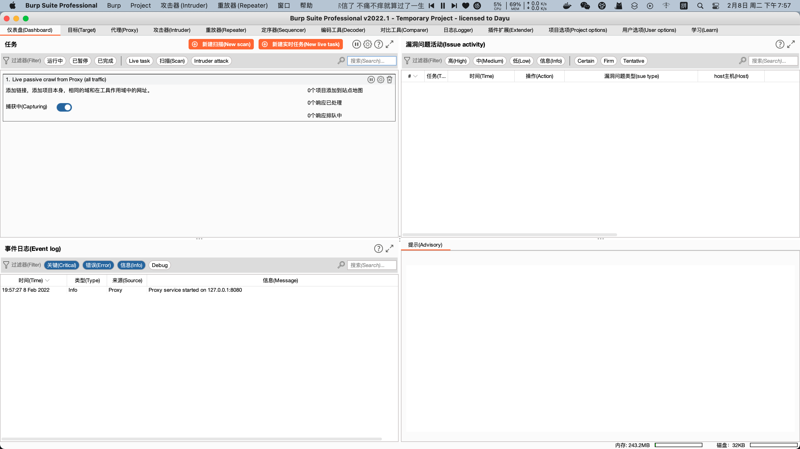
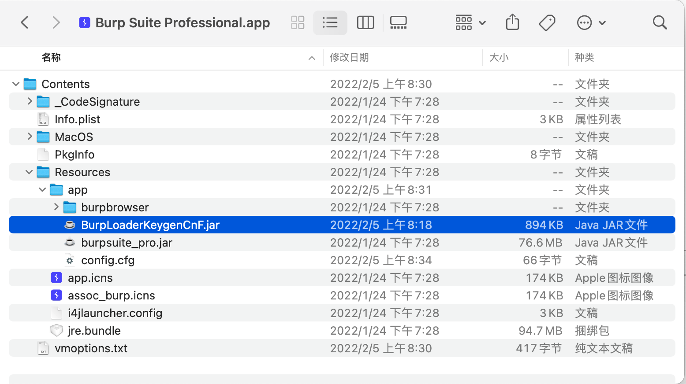

# macos_crack_burpsite_pro

jar的burp在我的黑果上跑着会莫名奇妙的java堆栈崩溃，换了java也没解决，参考了一下Google，发现dmg的burp自带java环境，也不会莫名其妙的崩溃，我把改好的burp丢上来macos重新破解一下应该就可以直接用，会弄的都会弄，我就不写了，而且这样有个好处，桌面上有burp的图标点开就行，比开个bash去跑要方便一点。

